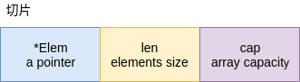
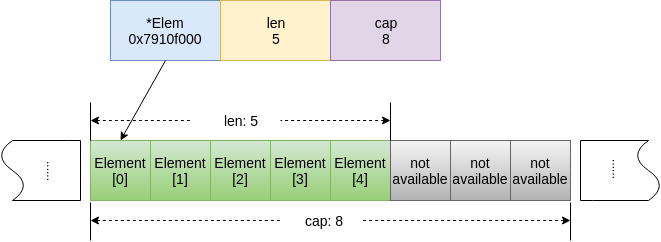
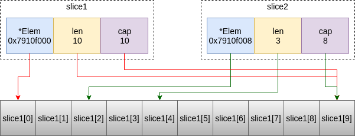

# 数组和切片

## 数组

数组是Go中的一种组合类型，代表这内存中一段连续的存储空间，上面保存了程序中一系列同一类型数据。例如 `a [10]int` 表示10个标准整型的数组。

必须注意的是Go中的数组类型与其他语言中的不一样，数组的类型包括长度，也就是 `a [10]int` 与 `b [5]int` 是两种不同的类型，如果忽略了长度区别，编译时会报错。

### 数组初始化

与C语言等保持一致，数组使用花括号进行初始化，将数组元素依次写入在花括号中，每两个元素中间逗号分隔。如 `arr := [3]int{0, 2, 4}` 。

> 值得注意的是，其他语言都要求数组在初始化时必须指定每个元素的值，而go不需要，可以只指定部分元素的值，其他未显式指定值的元素，编译器会初始化为该类型的零值。如 `arr := [5]int{0, 2, 4}` 是合法的，得到的arr将为 `[0, 2, 4, 0, 0]` 。

### 操作数组元素

使用中括号序号语法可以对数组中的元素进行读写操作：

```go
arr := [5]int{1, 2, 3}
// elem will be 3
elem := arr[2]
// arr will be [1, 2, 3, 4, 0]
arr[3] = 4
```

[例子 数组](examples/ep02/array_type.go)

> range关键字用于迭代读取一个集合类型（数组、切片、字典），还可以用于迭代读取一个通道消息（详见 [EP.XV 通道](Episode.XV.Channel.md)）。注意的是，range每次迭代集合时返回的是两个值，对于数组和切片来说，第一个值是迭代的序号，第二个是元素的值，对于字典来说，第一个是字典的键值key，第二个是字典的值value。

## 切片

数组的类型限制比较大，因此通常我们用切片来替代数组。切片slice是一个内建的结构体，包含三个字段，指向底层数组的切片第一个元素的指针、切片的有效长度（现有元素个数）和切片的容量（不扩容之前能容纳元素的个数）。



可以看到，切片实际上并没有真正存储数据，切片的数据实际上是存储在切片指向的底层数组结构上。



### 切片初始化

切片初始化的语法与数组初始化的语法相同，唯一区别是切片不固定长度，例如 `slice := []int{0, 2, 4}` 。当初始化切片时，go会创建一个底层数组用于真实存储数据，同时也会创建切片结构指向该数组。底层数组依照最小化内存占用原则创建，如上例中切片的len和cap都是3。

### 获得切片的有效长度和容量

go内建了len函数用于获得集合类型（数组、切片、字典）的有效长度，例如 `len(slice)` 。

内建的cap函数用于获得集合类型（数组、切片）的容量，**注意不包括字典类型**，字典类型（详见 [EP.IV 字典](Episode.IV.Map.md)）没有容量的概念。

### 构建切片

切片可以在程序运行时根据需要进行创建，并且将所有元素初始化为零值。go内建的make函数可以进行切片的构建，make函数的签名如下：

```go
func make(t Type, size ...IntegerType) Type
```

第一个参数为一个类型，可以为切片、字典或通道，后面有一个可变参数，接受的都是整数类型，如果有，则第一个整数为有效长度，第二个整数为容量。通常我们可以使用下面的语法来构建切片：

```go
// make a int slice with len=3 and cap=3, go will try to use minimun memory size
slice1 := make([]int, 3)
// make a string slice with len=5 and cap=10
slice2 := make([]string, 5, 10)
```

### 操作切片

切片的长度和容量与数组不一样，是可变的，因此我们可以添加元素到切片当中。此时如果切片的容量足够存储添加的元素，则仅需要将新的元素值存储在底层数组的相应位置并且修改切片的有效长度len即可；如果切片的容量已经不够存储添加的元素，则需要进行扩容，做法是新分配一个新的底层数组，足以容纳切片中所有的元素。

内建append函数用于对切片进行添加元素操作，例如：

```go
// len(slice) = cap(slice) = 3
slice := make([]int, 3)
// len(slice) = 4, cap(slice) = 6
slice = append(slice, 1)
// len(slice) = 7, cap(slice) = 12
slice = append(slice, 2, 3, 4)
```

append函数的签名如下：

```go
func append(slice []Type, elems ...Type) []Type
```

append可以每次增加1个到多个的元素，参数elems是一个变长的参数，可以接受多个参数值。

> 注意，使用append函数的时候必须使用变量接受函数的返回值，因为在添加元素的情况下，append一定会返回一个新的slice结构，而不是修改原来的slice结构体的数据。

如果需要在slice后面添加另一个slice的全部元素，可以使用...语法将另一个slice打散成为可变长参数：

```go
slice1 := make([]int, 3)
slice2 := []int{1, 2, 3, 4}
// slice1 will be [0, 0, 0, 1, 2, 3, 4]
slice1 = append(slice1, slice2...)
```

### 将数组切片

如果我们需要将数组中的其中一段做成一个切片，我们可以使用简单的中括号语法 `[startInclusive: endExclusive]`，前一个序号是切片开始的位置序号，从0开始，包括在切片当中，后一个序号是切片结束的位置序号，不包括在切片当中。事实上，大多C语言类生出来的语法都遵循这个半闭半开区间的法则。例如：

```go
arr := [10]int{1, 2, 3}
// slice1 will be [2, 3, 0, 0]
slice1 := arr[1:5]
// slice2 will be [1, 2, 3]
slice2 := arr[:3]
// slice3 will be [0, 0, 0, 0, 0]
slice3 := arr[5:]
// slice4 will be [1, 2, 3, 0, 0, 0, 0, 0, 0, 0]
slice4 := arr[:]
```

从上例中我们可以看到，start和end都可以省略，省略之后就代表着从第一个元素开始或到最后一个元素为止。

> 留意slice4，切片时同时省略了start和end，代表着从第一个元素开始到最后一个元素为止（都包括）。意味着得到的结果和arr的元素是完全一样的。但是必须明确的一点是slice4和arr的类型是不一样的，slice4的类型是切片`[]int`，而arr的类型是长度为10的数组`[10]int`，因此当我们需要将数组整体转换成一个切片时，slice4的语法就是我们需要的方式。

> 从上述切片语法中我们可以知道`arr[2:3]`同样也可以寻找到arr中的第三个元素，但是它与`arr[2]`有着本质的区别，`arr[2:3]`获得的是一个切片`[]int`（有效长度为1），而`arr[2]`获得的是一个`int`。

> 如果你熟悉python的语法，那么你一定觉得go的切片和python的list slice非常相似，是的，它们的基本语法是一致的。但是go中的切片没有提供切片的步长以及反向切片的语法。

### 切片的切片，切片后的容量

上述对数组切片的语法可以不做任何修改即移植到对切片进行切片的操作上，例如：

```go
slice1 := make([]int, 10)
// take slice1 elements 2, 3, 4
slice2 := slice1[2:5]
// take slice1 elements 0, 1, 2, 3, 4, 5
slice3 := slice1[:6]
```

对数组或切片进行切片操作之后，新的切片的有效长度len是很容易知道的，上例中slice2的len为3，而slice3的len为6。但是新切片的容量会变成多少呢？

在任何情况下，切片的容量都取决于底层的数组。上例中，要了解slice2的容量情况，首先应该去了解slice1底层数组的情况。在slice1中，底层数组的容量实际上是10个元素，因此slice1的容量也是10。slice2取了slice1底层数组的3-5号元素，slice2的指针指向了底层数组的第三号元素，但是实际上底层数组在slice2结束位置后面还有5个元素，因此slice2的容量为8。



[例子 切片](examples/ep02/slice_array.go)

[上一篇 EP.I 类型、变量和常量](Episode.I.Type.md) <|> [下一篇 EP.III 字符串](Episode.III.String.md)
