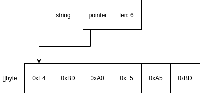

# 字符串

字符串是Go中的内建类型，用于表示一系列UTF-8编码的字符的组合，至少在实际应用中应该保证如此。Go中的string实际在内存中的底层表示是一个字节数组，而string本身仅维护了一个指向底层数组的指针及数组的长度（见下图）。因此，实际上来说，string内存储的字符不一定是可见的UTF-8字符，甚至有可能是不合法的UTF-8字符。



可以看到字符串结构中不含有slice的cap容量，这是因为在Go当中，字符串都是不可变的，也就是说你既无法修改底层数组的任何元素，也无法扩展append底层数组的容量。当对字符串进行操作（如连接）的时候，每次都会产生一个新的字符串。

> 我们来比较一下三门类型安全语言的字符串类型：Go，Java和Rust。因为Python对于字符串的处理有一些很神秘的魔法规则，且Python是一门动态类型语言，因此排除在外。
> - Go和Java一样，字符串都是不可变的，但是对于Java来说，字符串并非标准类型，而是一个对象，这意味着Java当中的每个动态创建的字符串对象都存在于堆heap中，一定会参与垃圾收集过程，而Go的字符串会由编译器决定是在栈stack中创建还是在堆heap中创建（当然这一切对于开发者是无感知的，只能通过profile之类的方法看到），但是这表明Go中的字符串未必需要垃圾收集。
> - Java中的字符串都是使用unicode编码的，因此统一每个字符都是两个字节长度，这也是Java中char的标准类型，而Go中的字符串使用的是UTF-8编码，是一种变长的编码方式（1-4个字节），也可以认为Go中字符串涵盖的字符集更广，在拉丁字母占多数的情况下占用内存更少。
> - Rust和Go的字符串都是基于UTF-8编码的，但是Rust采用了一种独特方式表达字符串，标准库中的String是一个结构体（对象，同样在堆heap中创建），底层是字节向量（`Vec<u8>` 等同于Go中的 `[]byte`），然后在结构体上实现了方法允许字符串可变，但是在传递中通常都仅使用不可变的字符串引用 `&str`，再通过拥有或借用模式由编译器实现快速传递。通常来说，Rust会有更高的性能，但是也意味着更陡峭的学习曲线。

## 字符类型 rune

很多语言都使用char表示单个的字符，对于C来说，char就是 `unsigned byte` ，Java中的char等同于 `short` ，这是因为C当中支持的字符就是扩展ASCII编码，而Java当中支持的字符就是unicode。Go使用rune作为标准字符类型，相当于 `int32`，可以存储所有的UTF-8字符。

> 为什么不使用 `uint32` 而使用 `int32` 作为 `rune` 的底层类型？第一是因为int32已经足够存储所有的UTF-8字符，更重要的是因为作为一种数值型类型，rune可以参与数学运算，比方说加和减，如果采用无符号类型，则无法准确表示减法的操作结果以及无法在加法操作时获得合适的溢出overflow错误。

## 字符串与切片的转换

字符串string可以与字节切片 `[]byte` 或字符切片 `[]rune` 进行直接转换：

```go
s := "你好，世界"
// bs为 []byte{0xe4, 0xbd, 0xa0, 0xe5, 0xa5, 0xbd, 0xef, 0xbc, 0x8c, 0xe4, 0xb8, 0x96, 0xe7, 0x95, 0x8c}
bs := []byte(s)
// rs为 []int32{20320, 22909, 65292, 19990, 30028}
rs := []rune(s)
```

或反过来：

```go
bs := []byte{0xe4, 0xbd, 0xa0, 0xe5, 0xa5, 0xbd, 0xef, 0xbc, 0x8c, 0xe4, 0xb8, 0x96, 0xe7, 0x95, 0x8c}
// s为 "你好，世界"
s := string(bs)
rs := []rune{20320, 22909, 65292, 19990, 30028}
// s同样为 "你好，世界"
s = string(rs)
```

## range 关键字

Go中提供了range关键字对集合进行遍历操作，集合类型包括数组、切片和字典map（详见[EP.IV 字典](Episode.IV.Map.md)）。range对其操作的数组和切片，进行逐个元素的遍历，每次返回两个值，第一个值是元素的序号（基于0），第二个值是元素的内容。range关键字只能和for循环关键字联用：

```go
a := []int{1, 2, 3}
for i, v := range a {
    // 输出：
    // Double of #1: 2
    // Double of #2: 4
    // Double of #3: 6
    fmt.Printf("Double of #%d: %d\n",i+1, v*2)
}
```

由于字符串的底层是字节数组因此，字符串也算作集合类型之一。但是当你希望遍历字符串底层数组中的每个字节时，结果可能会让你困惑：

```go
s := "你好"
for _, v := range s {
    // 你可能会预期输出6行，实际输出了2行
    fmt.Printf("%x", v)
}
```

原因就是range string的时候，range操作会将字符串按照UTF-8字符来进行遍历，因此得不到每个字节的内容，如果需要遍历每个字节，可以有两种选择：

```go
s := "你好"
for _, v := range []byte(s) {
    fmt.Printf("%x\n", v)   // 转换为字节切片后输出正确
}
for i := 0; i < len(s); i++ {
    fmt.Printf("%x\n", s[i])    // 使用len取得的是底层数组的长度
}
```

## 字符串运算

Go不支持运算符重载。因此对于字符串来说，Go语言本身为开发者实现了连接运算，即加法，与大部分语言保持一致。如 `"Alice" + "&" + "Bob"` 。

本节开头说明了Go中的string是不可变的，因此，连接操作每次都会产生一个新的字符串，如果这些字符串都创建在堆上，则会产生很多垃圾等待着收集，这种做法显然不是最佳的实践。如：

```go
s := "this "
s += "is "
s += "a "
s += "long "
s += "sentence."
```

相反，go的标准库中的fmt包提供了更加灵活和高效的解决方式：

```go
a, b := 1, 2
op := "add"
rm := "sums up"
// s为 "1 plus 2 sums up 3"
// 这种写法显然比
// strconv.Itoa(a) + " " + op + " " + strconv.Itoa(b) + " " + rm + " " + strconv.Itoa(a+b)
// 字符串连接写法要好
s := fmt.Sprintf("%d %s %d %s %d", a, op, b, rm, a+b)
```

详见：[EP.XIX 标准库](Episode.XIX.Stdlib.md)

## 字符串长度

如上所述，使用内建函数len返回的是字符串底层字节数组的长度，如果我们要获得string里面有多少个UTF-8字符，可以有两种选择：

```go
import unicode/utf8
// ......
s := "你好，世界"
// 均输出 5
fmt.Println(len([]rune(s)))
fmt.Println(utf8.RuneCountInString(s))
```

[例子 字符串](examples/ep03/string_type.go)

 [上一篇 EP.II 数组和切片](Episode.II.Slice.md) <|> [下一篇 EP.IV 字典](Episode.IV.Map.md)
