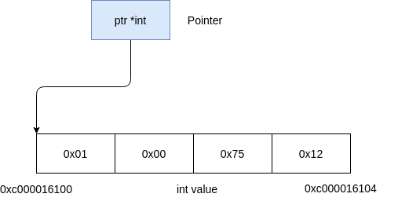
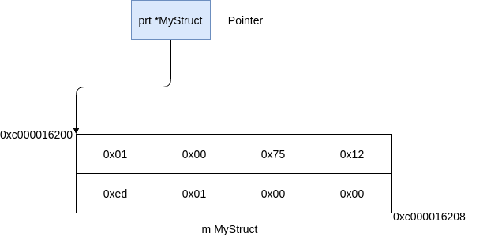
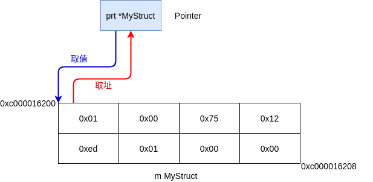
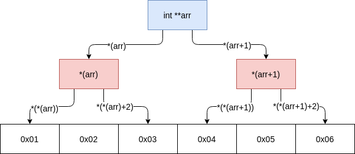
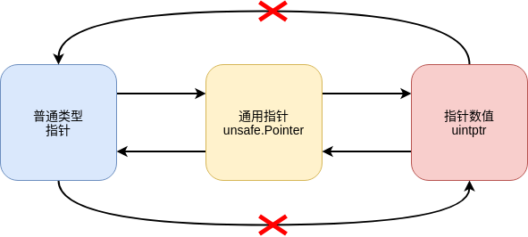

# 指针

如果有编程语言基础的话，你可能对指针已经有过一定的了解，例如C/C++语言中的指针，C++/Java/Rust当中的引用，Python当中所有的变量。也有可能你已经默默在使用着指针或引用的概念，但是你并没有意识到它的存在。

指针（Pointer），顾名思义，就是一个用来指向真正数据值的地址，如下图，我们有一个标准整型数据存储在内容中，它一共占用4个字节，那么我们可以用一个地址变量来代表这个值，该地址就是数值在内存空间的首字节的地址：



图中的Pointer是一个指针变量，它存储的值是内存中一个标准整型数据的首字节地址（图例中是`0xc000016100`），因此你可以认为该指针就是指向这个地址，因为这个指针指向的数据类型是`int`，因此该数据占据了4个字节的空间，从`0xc000016100`到`0xc000016104`，该段内存空间数据包含着一个整数`0x12750001`（这里使用的是小尾字节序）。在这个例子中我们看不清楚指针的优势，下面我们用一个结构体作为例子：

```go
type MyStruct struct {
    ID int
    Mod uint16
}

m := MyStruct {
    ID: 0x12750001,
    Mod: 0755
}
```

如果我们想用一个指针指向m变量，那么示意图如下：



图中的指针指向了一整个结构体数据，该数据在内存中占用8个字节空间（有关对齐参见[EP.VI 结构体](Episode.VI.Struct.md)）。因为该指针指向的数据类型是`MyStruct`结构体，所以我们也可以知道这个数据的前四个字节是结构体的`ID`字段，随后两个字节是结构体的`Mod`字段，最后两个字段是对齐字节。因此我们可以使用指针来指示内存中任意大小的空间位置，使用指针类型可以为我们提供下面的能力：

- 由于Go语言的传值特性，当传递结构体时，实际上是复制了一份结构体的副本到函数的实参中运行，因此无法在函数中直接修改原结构体的内容。指针为我们提供了这种通过函数修改调用者形参的能力。简单来说，就是如果需要在函数中修改参数原结构体的内容的话，使用指针进行传递是最直接的方式。
- 如果多个协程（参见[EP.XIV 协程](Episode.XIV.Goroutine.md)）需要共享一个结构体内容并进行修改，使用指针进行传递也是最简单的方式。
- 如果一个数据结构占用内存较大，这时依赖值传递会导致大量的内存复制操作，影响性能。传递指针能够避免这个缺点。
- 强行使用不安全（unsafe）特性时（参见[不安全特性](#不安全特性)），可以实现部分C语言一样的高级指针功能，从而满足一些比较底层的操作和任务。

从上面的讨论我们可以知道，指针最基本的操作有两种：取值和取址。取值就是取得指针所指向的数据内容的值，相反，获取数据内容空间的地址被称为取址：



## 指针变量声明和初始化

如果我们需要定义一个指针变量用来指向特定类型的数据内容，可以使用变量声明的语法：

```go
var intPtr *int
```

按照语法规则我们知道，`intPtr`变量的类型是`*int`，表示一个指向标准整型的指针，将`*`号放置在类型名称之前，即可表示这是一个指向该类型数据的指针。例如上面的结构体指针：

```go
var p *MyStruct
```

这样声明的变量也会进行初始化，Go编译器会将它初始化成指针类型的零值`nil`，也就是我们通常认为的空值。这代表这该指针虽然已经有了类型，但是它并没有指向任何有效的内存地址。

### 取址初始化

空值`nil`的指针，很显然无法进行取值操作，例如下面的代码：

```go
func main() {
	var p *int
	fmt.Println(*p)
}
```

语法是没有问题的，本来意图是打印`p`指向的标准整数值。但是运行会发生下面的错误，程序会`panic`：

```bash
panic: runtime error: invalid memory address or nil pointer dereference
[signal SIGSEGV: segmentation violation code=0xffffffff addr=0x0 pc=0xe01da]
```

错误的原因是访问内存地址错误或者空指针。因此我们需要为指针赋值一个合法的内存访问地址，其中一种方法是直接从一个内存值当中进行取址操作获得：

```go
func main() {
	a := 100
	var p = &a
	fmt.Println(*p)
}
```

[运行这个例子](https://goplay.space/#a0G9cXBL5GI)

即可得到预料中的输出`100`，其中变量`a`前面的`&`符号表示对变量a进行取地址操作，Go编译器可以自行推断出`p`的类型为`*int`。同样的，指针变量也可以使用短变量声明方式`p := &a`，结果相同。

### new初始化

还有一种对指针变量进行初始化的方式，就是使用内建的new函数，new函数的签名如下：

```go
func new(Type) *Type
```

接受任何类型作为函数输入参数，该函数会在内存中申请一个新的空间（大小为类型`Type`的占用空间大小），并将该空间的首字节地址返回。例如：

```go
func main() {
	p := new(int)
	fmt.Println(*p)
}
```

[运行这个例子](https://goplay.space/#hl8Ej1Hj1NX)

例子中使用`new`函数创建了一个标准整数内存空间，将其地址赋值给`p`，然后打印`p`指向的整数值，由于该标准整型没有显式初始化，因此具有零值，即整数0。

### 取值取址

前面的例子我们已经看到，在指针变量前加`*`号可以对指针进行取值操作，也就是将`*Type`类型变为`Type`类型。在其他类型变量前加`&`号可以对该数据进行取址操作，也就是将`Type`类型变为`*Type`类型。以下两行代码互为逆反的取址取值操作：

```go
p := &v
v = *p
```

### 结构体指针

结构体指针的使用与其他类型并无区别，其实在上一章结构体中我们就已经接触到了结构体指针，当我们将JSON字节串反序列化到结构体时，我们需要使用该结构体的指针作为参数，传递给`json.Unmarshal`函数：

```go
type MyStruct struct {
	ID   int    `json:"id"`
	Name string `json:"name"`
}

func main() {
	s := `{
		"id": 10000,
		"name": "John Doe"
	}`
	var m MyStruct
	json.Unmarshal([]byte(s), &m)
	fmt.Printf("%+v\n", m)
}
```

[运行这个例子](https://goplay.space/#58hhAaMFaDA)

上面的例子会输出`{ID:10000 Name:John Doe}`，我们留意`json.Unmarshal`函数的调用，第二个参数将`MyStruct`结构体`m`进行了取址操作，得到的是`*MyStruct`指针类型，当然`m`结构体变量的声明改成`m := MyStruct{}`的方式也是一模一样的意思。

当然上面我们看到了可以使用内建`new`函数来初始化指针，因此下面代码的运行结果也是一样的：

```go
type MyStruct struct {
	ID   int    `json:"id"`
	Name string `json:"name"`
}

func main() {
	s := `{
		"id": 10000,
		"name": "John Doe"
	}`
	p := new(MyStruct)
	json.Unmarshal([]byte(s), p)
	fmt.Printf("%+v\n", *p)
}
```

[运行这个例子](https://goplay.space/#tUz-_YyZBCe)

三个区别：
- `p`直接是指针类型，使用`new`函数初始化。
- `json.Unmarshal`调用时不再需要取址操作，因为`p`本身就是结构体指针了。
- 打印时需要使用`*p`进行取值操作，因为我们需要打印结构体的内容。

### 使用指针访问结构体的字段

如果有一个指针指向内存中某个结构体，那么显然这个指针的类型就是`*StructType`。我们已经知道可以使用`*`访问到该结构体，因此显然我们可以接着使用`.`号来访问结构体的字段。例如：

```go
s := &struct {
    ID int
    Name string
}{
    ID: 200,
    Name: "Jane Doe",
}
fmt.Println((*s).Name)
```

[运行这个例子](https://goplay.space/#VloLI3UMQKR)

如果你熟悉C语言，你就会猜想，使用`->`符号也可以用指针直接访问结构体的字段，用上面的例子来说就是`s->Name`。在Go语言当中，这个符号是不存在的，但是同时Go中提供了一个语法糖，允许直接使用结构体指针访问结构体的字段，符号仍然是`.`，例如：

```go
s := &struct {
    ID int
    Name string
}{
    ID: 200,
    Name: "Jane Doe",
}
fmt.Println(s.Name)
```

[运行这个例子](https://goplay.space/#TgFn-SuuJp9)

两者的结果完全相同，也就是说，Go编译器自动判断处`.`符号前面的变量是原始结构体变量还是结构体指针变量，然后将其编译成合适的机器代码，用来获取相应结构体的字段值。因此，在Go当中要获取结构体字段内容时，你不用特别关注，指代结构体的到底是原始变量还是指针了。

### *一些需要注意的地方*

下面的内容涉及较底层的内存管理和指针操作内容，如果暂无需要，可以跳过，直接阅读[高阶指针](#高阶指针)。

#### 返回局部变量的地址（指针）

如果你熟悉C语言，你就知道下面的代码是很典型的**Never do this!**：

```C
int *f() {
    int i = 100;
    return &i;
}
```

或者有个更容易犯错的版本：
```C
int *f() {
    int v[3] = {0, 10, 20};
    return v;
}
```

上面的问题在于，在函数`f`中返回了局部变量的地址或者指针，这会造成严重的问题，轻则导致程序`Segmentation fault`而退出，即内存段错误；重则产生严重的安全问题。因为在C语言中，函数的局部变量都是分配在栈区的，栈区内存随着函数运行结束，就会被回收，如果在函数中返回了栈区内存的地址或指针，然后继续使用，就会产生及其严重的后果。

在Go语言中，这个问题是不存在的，例如下面的代码：

```go
type MyStruct struct {
	ID   int
	Name string
}

func f() *MyStruct {
	m := MyStruct{
		ID:   100,
		Name: "John Doe",
	}
	return &m
}

func main() {
	fmt.Println(*f())
}
```

[运行这个例子](https://goplay.space/#MwF3yKqyjcJ)

我们看到结构体是`f`函数的局部变量，然后我们将它的地址（指针）返回给调用者，整个程序运行正常，没有内存的访问错误。这是因为Go编译能够发现`m`变量存储的结构体在离开函数后还会使用，因此会自动的将其分配到堆区，而不是栈区，这样就会避免了在C/C++语言中的错误。

#### 安全指针

在使用C语言的指针时，经常会碰到越界访问的情况，C语言编译器和运行时都不会检测和报告这个错误，例如：

```C
#include <stdio.h>

int main() {
  int arr[3] = {1, 2, 3};
  printf("%d\n", *(arr+3));
}
```

如果你使用`gcc`编译这段代码时，编译器不会报错，甚至连一个警告都不会给出来。而且运行时程序也没有出错，输出的内容完全取决于当时函数栈区的初始状态。这种错误非常难以定位，甚至如果是内存写入操作的话，会导致整个系统的不稳定状态。这也就是我们在第一章中说C语言不是一门类型安全语言的原因。

反之，Go不会产生这样的问题，首先在通常情况下，Go的语法不允许对指针进行算数运算，甚至连对数据结构进行内存长度计算都不在通常语法范围之内。如果确实需要操作底层指针，必须明确的使用标准库中的`unsafe`包，这样可以将危险的操作限定在最小的范围之内，参见[不安全操作](#不安全操作)。

> Rust解决不安全操作的问题更加自由，提供了语法关键字`unsafe`，可以将相应的不安全操作定义到`unsafe`代码结构块中，而不需要每次都引用某个库。

## 高阶指针

高阶指针也可以称为指针的指针，例如在C语言中，最常见的例子可以是一个二维数组：

```C
#include <stdio.h>

int main() {
  int arr[2][3] = {{1, 2, 3}, {4, 5, 6}};
  printf("%d\n", *(*(arr+1)+2));
}
```

很显然，写出这种代码需要对计算机内存管理有着较深入的理解。如果你能预测到这段代码的输出是6，那么你对C语言中的高阶指针已经有了一定掌握。正如下图所示：



幸运的是，Go语言不需要你进行这样复杂（又危险）的指针操作。虽然Go中的二维数组也需要使用高阶指针来实现，但是因为提供了切片（参见[EP.II 数组与切片](Episode.II.Slice.md)），因此实现起来容易理解很多：

```go
arr := [][]int {
    {1, 2, 3},
    {4, 5, 6},
}
fmt.Println(arr[1][2])
```

[运行这个例子](https://goplay.space/#uy5p-DmyCxF)

回忆一下前面的内容，实际上切片是一个结构，其中包括一个指向底层数据结构的指针，那么上面代码当中的`[][]int`实际上就是一个底层数据结构是`[]int`的切片，可以称为切片的切片，由于切片包含着指针，因此实际上就是高阶指针。从下面这个动态非矩形二维数组例子中可以看得更清楚：

```go
arr := make([][]int, 3)
for i := 0; i < 3; i++ {
	arr[i] = make([]int, i+1)
	for j := 0; j <= i; j++ {
		arr[i][j] = i + j
	}
}
// 输出结果 [[0] [1 2] [2 3 4]]
fmt.Println(arr)
```

[运行这个例子](https://goplay.space/#-VSWPaUWYM5)

在其他情况下，你一般不需要在Go中用到高阶指针，除非你真的想要炫耀一下。因此掌握使用高维数组（切片）已经能让你在Go的高阶指针中游刃有余。

## 结构体的指针字段

上一章中，我们说到结构体的字段可以接受任何类型，因此指针也是可以作为结构体字段类型的，甚至可以使用结构体自身的指针作为字段类型，例如定义一个二叉树的结构体：

```go
type BinaryTreeNode struct {
    Val   int
    Left  *BinaryTreeNode
    Right *BinaryTreeNode
}
```

用C语言学习过数据结构的读者是不是感觉很熟悉？没错，这就是构建复杂二叉树结构的基本单元，`Left`和`Right`分别代表左右子节点。由上面的定义，我们很容易写出该二叉树深度遍历的函数：

```go
func DeepTraverse(node *BinaryTreeNode) {
    if node.Left != nil {
        DeepTraverse(node.Left)
    }
    fmt.Println(node.Val)
    if node.Right != nil {
        DeepTraverse(node.Right)
    }
}
```

下面我们用一个玩具式的双链表程序作为例子整体说明一下指针、结构体指针和字段指针的应用。

[例子：双链表的结构体与指针实现](examples/ep07/linked_list.go)

## *不安全操作*

本小节涉及Go语言指针高级使用内容，通常情况下并没有绝对必要性需要使用到，因此可由读者选择是否跳过。

在C/C++语言中，指针实际上就是一个无符号整数，可以在此基础上进行任意算术运算。在前面的[安全指针](#安全指针)一节中我们已经说过，这种操作是不安全的，经常会导致很严重的系统错误甚至安全问题。因此，Go语言中默认不允许对指针进行此类运算。但是如果在进行一些底层操作时，例如需要直接访问某个设备的内存缓冲区又或者是某个系统调用使用了无法用Go类型系统模拟的内存结构时，这种操作的缺失会令Go无法满足相应的需要。因此Go提供了不安全的操作作为补充。

不安全的操作放置在标准库的`unsafe`包中，使用这个包的内容，你可以绕过Go语言的类型安全系统而直接的操作内存地址内容，你可以将其解读为其他类型的数据，甚至可以将其修改成不同的底层字节表示。

> 特别注意：除非迫不得已，不要使用不安全操作，这种需求在绝大多数情况下是不存在的。

我们来看一个例子：

```go
func main() {
	s := []byte{0x11, 0x62, 0x0, 0x0}
	// 将上述字节切片的第一个元素地址转换为unsafe的通用指针类型
	p := unsafe.Pointer(&s[0])
	// 下面将这个指针转换为字符指针类型然后将其值转换为字符串输出：输出结果“我”
	fmt.Println(string(*(*rune)(p)))
}
```

[运行这个例子](https://goplay.space/#OCKWZlQZOmq,8)

上面我们定义的本来是一个字节切片，使用取址操作将其第一个元素的地址取出，并转换为`unsafe.Pointer`类型，该类型是`unsafe`包中定义的一个通用指针类型，可以将任意类型的指针代入获得，这里已经首先违反了Go的类型安全机制，因为此时我们获得的是一个无类型的指针。然后下面我们将这个无类型指针再次转换为`*rune`类型，也就是Go中的字符指针，这里我们再次违反了类型安全机制。为了打印字符，最后取得字符指针的值转换为`string`字符串类型后输出。得到的输出是`我`中文字符。

> 这种转换都是不安全的，这也是`unsafe`包名称的由来。因为在进行这种转换的时候，只有编写这段代码的程序员自己才清楚原指针与目标指针是否类型兼容，是否存在着边界问题没有进行判断（实际上上面例子就有边界问题，byte是无符号数，而rune实际上是int32是有符号数）。在这样的操作中，所有Go编译器的类型安全机制都已经失效，代码运行期的行为完全只能由程序员自己负责。

> 上述的代码看起来也令人难以理解，基本失去了可读性，如果没有注释的话，其他人可能完全无法理解这段代码的含义，这也在另一方面说明了不安全操作的定义。

除了内存数据内容类型转换外，`unsafe`包还提供了一个`uintptr`类型，该类型是一个无符号整数，可以用来存储指针数值，但是该类型仅能从`unsafe.Pointer`通用指针类型转换得到，不能从其他任何类型的指针进行直接转换。例如：

```go
i := 1024
// 将i取址的指针转换为通用指针再转换为uintptr，允许的操作
p := uintptr(unsafe.Pointer(&i))
// 错误：将i取址的指针直接转换为uintptr，不允许的操作
ptr := uintptr(&i)
```

类型指针、通用指针和uintptr三者之间的关联如下：



将通用指针转换成uintptr后，就可以进行数值运算了，因为uintptr就是一个无符号整数。例如，下面的例子中有一个特殊的内存区域，该区域分成两块，头部和内容，头部的前16位二进制数代表头部的长度，内容紧接着头部存储，内容就是一个当前主机字节序的64位浮点数，下面代码直接取得内容并打印：

```go
func main() {
	// s是内存中一段内容，共16字节，头两个字节代表头部长度，内容共8个字节，
	// 是一个魔术数字，3.14159的64位浮点数内存字节内容
	s := []byte{0x8, 0x0, 0x0, 0x2, 0x0, 0x1, 0xff, 0xff,
		0x6e, 0x86, 0x1b, 0xf0, 0xf9, 0x21, 0x9, 0x40,
	}
	// 取出第一个元素地址，转换为通用指针
	p := unsafe.Pointer(&s[0])
	// 将头两个字节转换为16位无符号整数，此处得到offset为8
	offset := *((*uint16)(p))
	// 将p与位移offset相加，得到的地址为内存切片第九个元素的地址，再转换为通用指针，
	// 最后转换为64为浮点数指针，取值到value变量
	value := *((*float64)(unsafe.Pointer(uintptr(p) + uintptr(offset))))
	// 此处输出为3.14159
	fmt.Println(value)
}
```

[运行这个例子](https://goplay.space/#rD5dqeS83cQ)

上例中采取了更加不安全的操作，我们对指针进行的算术运算，此处是加法，我们通过头部前两个字节获得了内容的起始位置偏移量`offset`，然后利用通用指针转换为`uintptr`将`offset`位移加到了首地址上，即可得到内容起始地址，最后再次通过通用指针和`*float64`指针转换得到了该内容的对应值，输出了浮点数`3.14159`。通过这个例子可以看到，我们可以使用`unsafe`包完成基本所有底层的内存操作，付出的代价是代码失去了类型安全保障和可读性。

> 注意：Go的`unsafe`和C语言还是不一样，`uintptr`算术操作依然无法越界访问，如果试图这样做的话，运行时会`panic`，内存访问错误。从这一点来看，至少`unsafe`还是尽量保证的系统安全性。

> 注意：上述例子中不是故意要将`value`赋值那个语句写的那么长的，你可能会认为按照如下方式写的话，能增强代码可读性：
> ```go
> ptr := uintptr(p) + uintptr(offset)
> value := *((*float64)(unsafe.Pointer(ptr)))
> ```
> 事实上，上面的写法是错误的。Go语言标准中明确支出不要为`uintptr`生成临时变量，因为Go的垃圾收集机制为了消除内存碎片可能会转移内存数据存储位置，同时更新所有指向该位置的指针内容，但是由于`uintptr`不是指针类型，它并不会被更新到指向新位置，在这种情况中，上述代码中的`ptr`数据可能就是过时的错误的地址，再次进行访问时程序会出错。

[EP.VI 结构体](Episode.VI.Struct.md) <|> [EP.VIII 方法](Episode.VIII.Method.md)